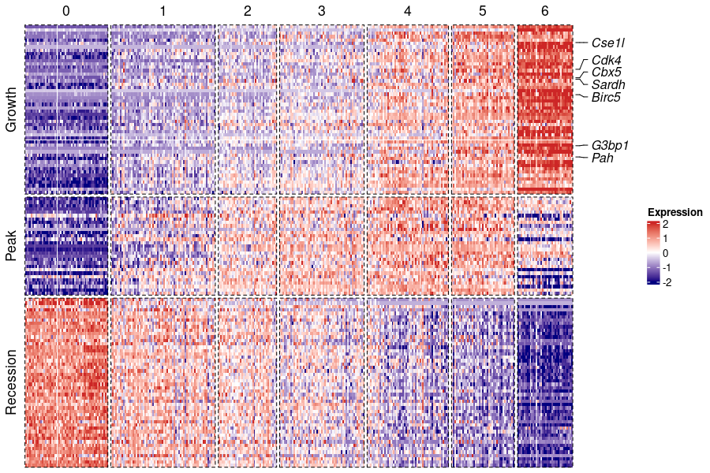
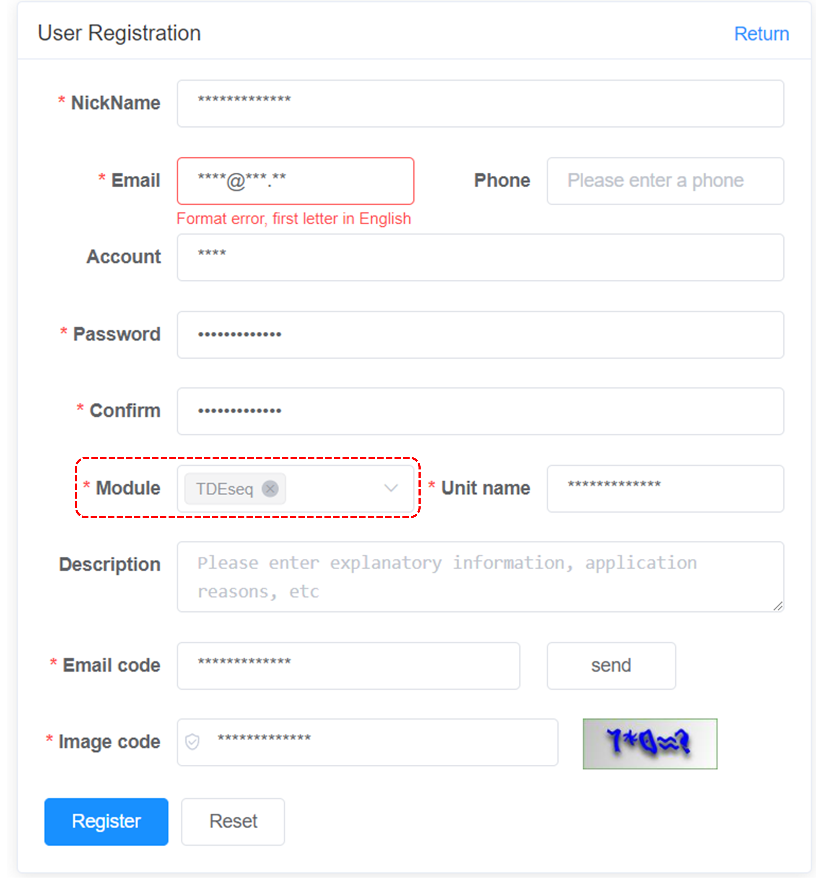

## 1. Overview
TDEseq is implemented as an open source R package for detecting genes with temporal dynamic expression patterns in time-series scRNA-seq transcriptomic studies. TDEseq primarily builds upon the linear additive mixed model (LAMM) framework, with a random effect term to account for correlated samples in time-resolved or time-course scRNA-seq studies. In this model, we typically introduce the quadratic I-splines and cubic C-splines as basis functions, which facilitate the detection of four potential temporal gene expression patterns, i.e., growth, recession, peak, and trough. This vignette will illustrate some uses and visulization of TDEseq.


## 2. Installation
TDEseq is implemented as an R package, which can be installed from GitHub.
```
library(devtools)
install_github("fanyue322/TDEseq")
```

## 3. Usage
TDEseq starts with the normalized gene expression scRNA-seq data and the corresponding time points. 

### Application on mouse liver development data
We used a sample mouse liver development during embyro process scRNA-seq data as a main example which contains expression measurement of 14,226 genes on 345 cells. This dataset can be downloaded from their original study GSE90047. We also saved the processed data that we used in our examples in RData format, which can be downloaded from [here](https://zenodo.org/record/8276740/files/scRNA-seq_liver_embryo.rda).
```
library(TDEseq)
load('scRNA-seq_liver_embryo.rda')
counts<-Seurat::GetAssayData(seurat,'counts')  ##raw counts data
data.norm<-Seurat::GetAssayData(seurat,'data') ##log normalized data
meta.data<-seurat@meta.data                    ##metadata
```
### Detecting temporal DE genes through TDEseq
To run TDEseq on scRNA-seq data, a user should consider the minimal parameter set for the wrapper function `TDEseq`:

· data.norm（normalized scRNA-seq data)

· meta.data （a dataframe contained time points and individual information)

TDEseq takes the normalized data and a meta data as inputs, and output the p-value and pattern information for each gene.
The gene expression data format:

|      | E10.5D_1_01| E10.5D_1_02| E10.5D_1_03| E10.5D_1_04| E10.5D_1_05| E10.5D_1_06|
|:-----|-----------:|-----------:|-----------:|-----------:|-----------:|-----------:|
|Gnai3 |   1.2575920|   1.3618800|   1.0647014|   1.0578996|   1.4092147|   1.1380617|
|Cdc45 |   1.0757164|   0.2382423|   0.9187661|   0.9054553|   0.3632458|   0.7534112|
|H19   |   2.0985043|   2.1759738|   1.8616150|   1.6786874|   1.5646516|   1.6727125|
|Scml2 |   0.0000000|   0.0000000|   0.1631383|   0.0000000|   0.0000000|   0.2138798|
|Apoh  |   0.0308504|   0.0092337|   0.1028170|   0.0086277|   0.0351299|   0.0252298|
|Narf  |   0.3709296|   0.7995276|   0.2663387|   0.4411944|   0.2089655|   0.0000000|

The meta data should contain the information of time points/stage for each cells.

|            | stage|group  |
|:-----------|-----:|:------|
|E10.5D_1_01 |  10.5|E10.5D |
|E11.5D_1_06 |  11.5|E11.5D |
|E11.5E_2_10 |  11.5|E11.5E |
|E13.5E_2_01 |  13.5|E13.5E |
|E14.5E_1_13 |  14.5|E14.5E |
|E15.5D_4_12 |  15.5|E15.5D |

Where the "stage column contains the time points/stage for each cell (embryo day in this example) and the "group" column contains the individual information (index of the mice in this example).
Here, we present a Linear TDEseq without batch effects controlling. TDEseq analysis can be performed as follows:
#### Create TDEseqObject 
Users can create TDEseqObject from gene expression data
```
tde <- CreateTDEseqObject(counts = counts,data=data.norm,meta.data=meta.data)
```
Or from Seurat object directly
```
tde <- CreateTDEseqObject(counts = seurat)
```
#### Run TDEseq analysis
```
tde_method <- "cell"
tde_param <- list(sample.var = "group",
                 stage.var = "stage",
                 fit.model = "lm",
                 tde.thr = 0.05,
				         num.core=5)
tde <- tdeseq(object = tde, tde.method = tde_method, tde.param=tde_param)
```
An example seurat object file can be downloaded from [here](https://zenodo.org/record/8276740/files/scRNA-seq_liver_embryo_seuobj.rda).

The temporal differential expression results can be accessed as a data frame in the output object via `result<-GetTDEseqAssayData(tde,'tde')`. 

By default, TDEseq uses the Linear version. Alternatively, one can perform the mixed version of TDEseq, which accounts for individual level batch effects, such a batch structure could arise due to sample-level variation. This variable imposing the batch structure on the expression observations and can be specified by setting `sample.var="group"`. By accounting for batch effects in TDEseq, we set the `fit.model='lmm'`, e.g. : 
```
tde_method <- "cell"
tde_param <- list(sample.var = "group",
                 stage.var = "stage",
                 fit.model = "lmm",
				         num.core=10)
tde <- tdeseq(object = tde, tde.method = tde_method, tde.param=tde_param)
```
In this case the group information for each cell is required. The group information represents the sample-level variation of the scRNA-seq data. 

### Parameter settings
In `TDEseq()`, besides the default parameters, users can also set other parameters as below to filter genes or cells:
```
tde_param <- list(sample.var = "batch",
                 stage.var = "stage",
                 fit.model = "lm",
                 pct = 0.1,
                 tde.thr = 0.05,
                 lfc = 0.1,
                 max.gcells = Inf,
                 min.tcells = 3,
		             num.core=10)
tde <- tdeseq(object = tde, tde.param=tde_param)
```
1. Remove time points with too few cells by setting `min.tcells`. Here, time points with less than 3 cells will be removed.
2. Filter genes that are only expressed in a few cells by setting `pct`. Here, genes with more than 90% of zero counts will be filtered out.
3. Filter genes that show small average X-fold difference (log-scale) between any two time points by setting `lfc`. Here, we limit testing to genes which show at least 0.1-fold difference between any two time points.
4. Downsample cells by setting `max.gcells`. If max.gcells is smaller than the given number of cells in a sample, the down-sampling will be active. Here, we do not perform downsampling by setting `max.gcells=Inf`.
5. Perform parallel computing with 10 core by setting `num.core=10`.

### Association of gene expression with time points
The exploration of the data analysis consist of checking whether gene expression is associated with time points and the corresponding pattern. This can be interpreted as testing whether the average gene expression is significantly changing along time points with a specific pattern.

|gene  | increasing.pvalue| decreasing.pvalue| convex.pvalue| concave.pvalue| pvalue| padj|    aic.inc|   aic.dec|   aic.cov|  aic.con|SignificantDE |pattern   | ChangePoint|
|:-----|-----------------:|-----------------:|-------------:|--------------:|----:|----:|----------:|---------:|---------:|--------:|:-------------|:---------|-----------:|
|Apoh  |              0.00|              0.81|     0.0563112|      0.6699999|    0|    0|  518.56329| 1211.3285|  529.5136| 533.9445|Yes           |Growth    |          NA|
|Ccnd2 |              0.86|              0.00|     0.0000000|      0.7599999|    0|    0|  618.50895|  357.5597|  363.9423| 409.1350|Yes           |Recession |          NA|
|Pemt  |              0.00|              0.76|     0.0000000|      0.7100000|    0|    0| -202.52977|  570.8639| -200.4116| 431.1143|Yes           |Growth    |          NA|
|Haao  |              0.00|              0.84|     0.0234969|      0.0252611|    0|    0|   94.26462|  462.7439|  122.3448| 122.6517|Yes           |Growth    |          NA|

Here, `increasing.pvalue`,`decreasing.pvalue`,`convex.pvalue`,`concave.pvalue` are the p-values after testing whether gene expression is changing with a growth, recession, trough or peak pattern. 

`pval` is the p-value after Chuachy combination rule, and `padj` is the adjusted p-values after BY-correction. 

`aic.inc`,`aic.dec`,`aic.cov`, `aic.con` are the corresponding AIC score. TDEseq determines the `pattern` of each gene according to the AIC score, and `ChangePoint` represents the time points that gene expression trend changes(only exists for trough or peak genes).

## 4. Visualization
Here, we present the visualization of global expression patterns via a heatmap. We base this analysis on a classification of temporal differentially expressed genes according to the corresponding patterns. The function `PatternHeatmap` takes an output object of the class TDEseq. The output of `PatternHeatmap` is a object of the class ComplexHeatmap which can be plotted with `print()`. To performed `PatternHeatmap`, please first install ComplexHeatmap, Seurat and ggplot2 packages. 
To perform visulization function included in TDEseq, please library these packages first.
```
suppressPackageStartupMessages({
  library("Seurat")
  library("ggplot2")
  library("ComplexHeatmap")
  library("circlize")
  })
```
### Parameter settings

`obj`: The results of TDEseq analysis

`stage.id': The column name of time points in metadata.

`features`: Genes to be shown in heatmap. Default is NULL.

`features.show`: Genes to be annotated in heatmap.

`features.num`: Number of genes to be shown for each patterns. Default is 50.

`cols`: Color of the heatmap. Default is c("navy", "white", "firebrick3").

```
p<-PatternHeatmap(obj=tde,stage.id='stage',features.show=c("Cse1l","Cdk4","Cbx5","Sardh","Birc5","G3bp1","Pah"))
print(p)
```




## 5. Apply TDEseq on real scRNA-seq data
All scRNA-seq data sets used in our originial paper are available on [here](https://zenodo.org/record/8276740). For more time series scRNA-seq data, please refer [TEDD database](http://tedd.obg.cuhk.edu.hk/frontend/dist/index.html#/)

## 6. Web server of TDEseq
TDEseq is also developed within a web framework with and hosted at [our server](http://81.69.241.14/). This web framework minimizes inherent dependencies on specific hardware, software packages and libraries and file-system attributes. Through this interface, users can provide a gene expression matrix in csv format and a metadata in csv format and run TDEseq analysis directly. 

### How to register a new user
To register a new user follow these steps:

1. Visit [our server](http://81.69.241.14/) and click Register button
2. The sign-up form will appear. Follow the directions by entering the required information. Select "Role" as TDEseq.

3. You will receive a text message from our server with a verification code. Enter the code to complete the account verification.

### Usage
Our web version of TDEseq are organized into three steps: Upload data, Parameter settings and Visualization.

**A. Upload data.** The user can choose to upload normalised scRNA-seq gene expression data (genes by cells) in csv format as well as a metadata including time points and group information (specifying colnames as "Time" and "Group" and rownames as cell barcodes), or R data format including Expdata and Metadata formatted as the csv file. 

**B. Parameter settings.** The web version of TDEseq provides identical parameter settings to the R package version of TDEseq. Users can select appropriate parameters according to the parameter description. The detailed description of each patameters is as follow:

`logFC_threshold`: Limit testing to genes which show the maximum on average X-fold difference (log-scale) between any two time points. Default is 0.0.

`pct`: Only test genes that are detected in a minimum fraction of pct cells. Default is 0.1.

`threshold`: Only return markers that have an FDR(BY adjusted) < return.thresh. Default is 0.05.

`max_cells_per_ident`: Down sample each identity class to a max number. Default is no downsampling. 

`min_cells_per_timepoints`:Minimum number of cells in one of the time points. 

`LMM`:Denotes which methods to use. Default is FALSE(Linear TDEseq). Set `LMM=TRUE` to perform Mixed TDEseq.

`pseudocell`: Whether perform pseudo cell strategy or not. Default is NULL. Alternatively, users can set pseudocell as an integer(i.e. 20) to perform pseudocell analysis. Note that to perform pseudocell strategy, raw counts matrix instead of normalized gene expression data is required.

**C. Visualization.** The web version of TDEseq provides two approaches for user to visualise the analysis results. For the `heatmap`, the temporal expression genes are diveded into 4 types according to their pattern (growth, recession, peak and trough) and the corresponding heatmap is displayed with the clustered genes (As the temporal distinct patterns figure in our original paper). Users can select the genes of interest or the top 50 genes for each pattern ranked by p-values to display for the heatmap. Another approach is the `line`, which shows the smooth line estimated by TDEseq across all time points.


